# CLChart

Features:

Bars (plain, stacked, grouped, horizontal, vertical)
Scatter
Line / multiline
Areas
Bubble
Multiple axis
Multiple labels (x axis)
Candlestick
Cubic line
Custom units
Custom views

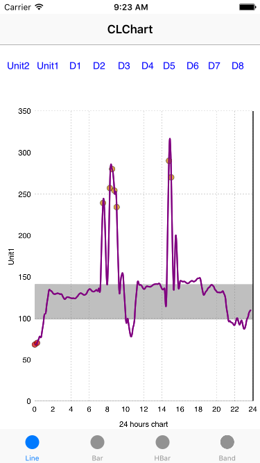
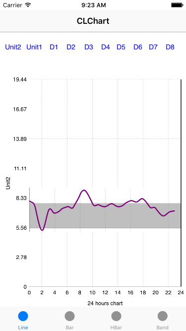
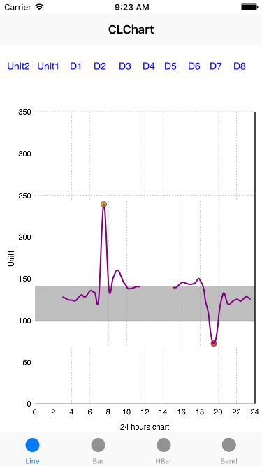
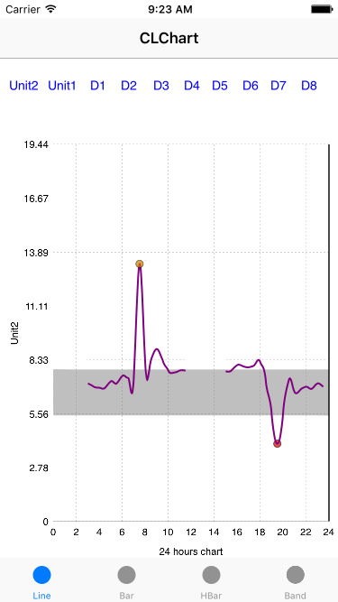
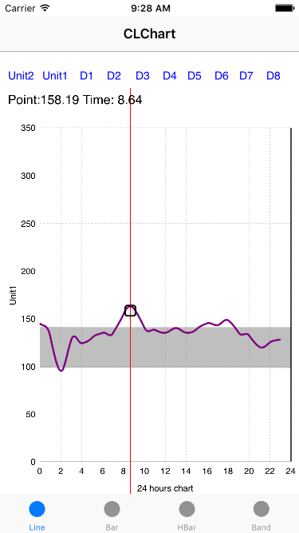
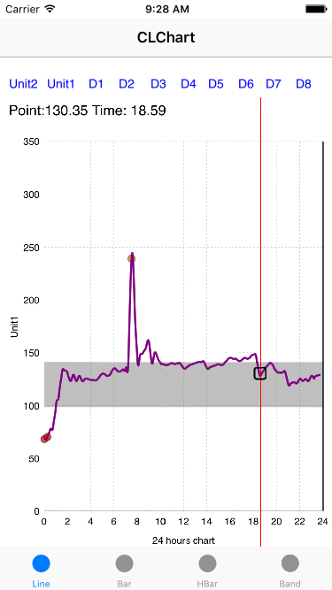

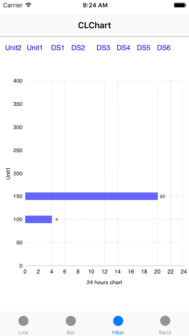
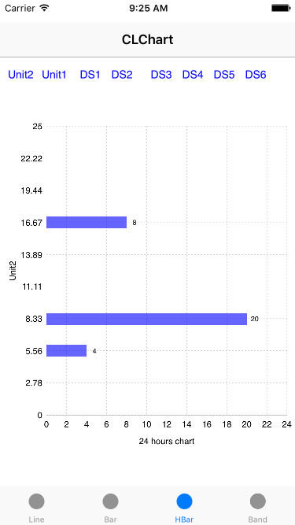
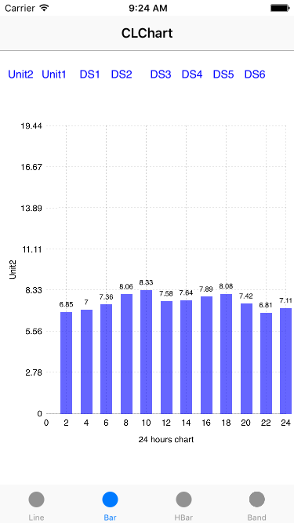
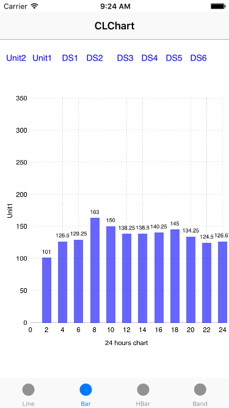

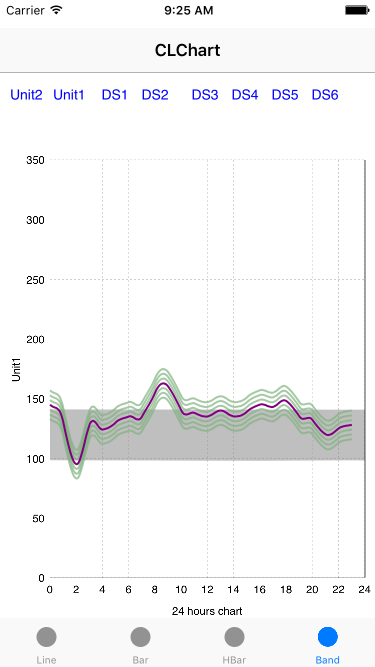
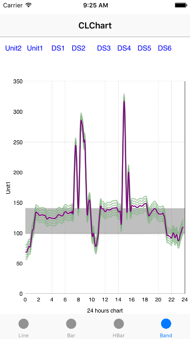